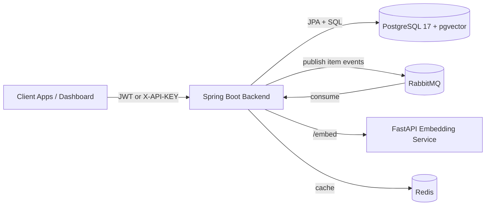

# Susume - Multi-Tenant Recommendation Engine

[](https://www.oracle.com/java/)
[](https://spring.io/projects/spring-boot)
[](https://www.postgresql.org/)
[](https://fastapi.tiangolo.com/)
[](https://react.dev/)
[](https://www.typescriptlang.org/)
[](https://www.docker.com/)

Susume is a full-stack SaaS recommendation platform that delivers personalized and trending recommendations in real time. It combines:

- multi-tenant isolation
- behavioral signals (view, click, like, purchase)
- semantic embeddings (Sentence Transformers)
- vector search in PostgreSQL

The goal of this project was to build a production-style recommendation engine with clear service boundaries, async processing, and an operator-friendly deployment model.

## Why This Project

Most recommendation demos stop at "model inference." Susume covers the full product lifecycle:

- secure tenant onboarding and access control
- item ingestion and asynchronous embedding generation
- interaction tracking and strategy-based recommendation retrieval
- dashboard and API surfaces for both business and engineering users

## Core Capabilities

- Multi-tenant architecture with tenant-aware request context and data access
- API key authentication for public API consumers and JWT auth for dashboard users
- Vector-based personalization using cosine similarity over dense embeddings
- Cold-start fallback to trending strategy when user history is sparse
- Asynchronous embedding pipeline using RabbitMQ between backend and embedding service
- Redis-backed caching for low-latency repeated access patterns
- Flyway migrations for schema versioning and reproducible database setup

## Architecture



### Recommendation Flow

1. An item is created or updated in the backend.
2. The item text payload is sent to the embedding service (through the async workflow).
3. The embedding vector is stored in PostgreSQL.
4. On recommendation request, user interactions are aggregated into a preference vector.
5. Candidate items are scored by cosine similarity and ranked.
6. If the user has insufficient history, the system returns trending items.

Similarity scoring uses:

$$
    score(u, i) = \frac{u \cdot i}{\|u\|\|i\|}
$$

## Tech Stack

- Backend: Java 17, Spring Boot 3.2, Spring Security, Spring Data JPA, Flyway
- Database: PostgreSQL 17, pgvector
- Embedding Service: FastAPI, sentence-transformers (all-MiniLM-L6-v2)
- Messaging + Cache: RabbitMQ, Redis
- Frontend: React 19, TypeScript 6, Vite, Tailwind CSS
- DevOps: Docker, Docker Compose

## Repository Structure

```text
.
|- backend/             # Spring Boot API
|- embedding-service/   # FastAPI embedding microservice
|- frontend/            # React + TypeScript dashboard
|- docker-compose.yml   # Local multi-service orchestration
|- TESTING_IMPLEMENTATION_SUMMARY.md
```

## API Surface (High Level)

### Authentication and User Lifecycle

- `POST /api/v1/auth/register-admin`
- `POST /api/v1/auth/login`
- `POST /api/v1/auth/logout`
- `POST /api/v1/auth/logout-all`
- `GET /api/v1/auth/verify-email`
- `POST /api/v1/auth/resend-verification`
- `POST /api/v1/auth/forgot-password`
- `POST /api/v1/auth/reset-password`

### Tenant Dashboard and API Keys

- `GET /api/v1/dashboard/tenant`
- `GET /api/v1/dashboard/stats`
- `POST /api/v1/api-keys`
- `GET /api/v1/api-keys`
- `GET /api/v1/api-keys/{id}`
- `DELETE /api/v1/api-keys/{id}`

### Catalog, Interactions, Recommendations

- `POST /api/v1/items`
- `GET /api/v1/items`
- `PUT /api/v1/items/{externalItemId}`
- `DELETE /api/v1/items/{externalItemId}`
- `POST /api/v1/interactions`
- `GET /api/v1/interactions/history/`
- `GET /api/v1/recommendations`
- `GET /api/v1/recommendations/trending`

## Local Setup

### Prerequisites

- Docker Desktop (or Docker Engine + Compose)
- Java 17 and Maven (for backend local run)
- Node.js 18+ (for frontend local run)
- Python 3.10+ (for embedding service local run)

### 1. Configure Environment

Create or update a `.env` file in the repo root. At minimum, define:

```env
POSTGRES_DB=susume
POSTGRES_USER=postgres
POSTGRES_PASSWORD=postgres
POSTGRES_VOLUME_SOURCE=./docker-data/postgres

EMBEDDING_SOURCE_VOLUME_SOURCE=./docker-data/huggingface

RABBITMQ_USERNAME=guest
RABBITMQ_PASSWORD=guest

JWT_SECRET=replace-with-long-random-secret
PRIVATE_KEY_PATH=/run/secrets/private.pem
PUBLIC_KEY_PATH=/run/secrets/public.pem
MAIL_PASSWORD=replace-mail-password
```

### 2. Run Everything with Docker Compose

```bash
docker compose up -d --build
```

### 3. Service Endpoints

- Backend API: `http://localhost:8080`
- Embedding service health: `http://localhost:8001/health`
- RabbitMQ management: `http://localhost:15672`
- Frontend: `http://localhost`
- PostgreSQL: `localhost:5433`

## Development Workflow

### Backend

```bash
cd backend
mvn spring-boot:run
```

### Frontend

```bash
cd frontend
npm install
npm run dev
```

### Embedding Service

```bash
cd embedding-service
pip install -r requirements.txt
uvicorn main:app --reload --host 0.0.0.0 --port 8001
```

## Testing

Run backend tests:

```bash
cd backend
mvn test
```

For implementation details and test coverage summary, see `TESTING_IMPLEMENTATION_SUMMARY.md`.

## Highlights for Recruiters

- Designed and implemented a production-style, multi-service recommendation architecture
- Built end-to-end personalization flow from event ingestion to ranked retrieval
- Applied practical security patterns (API keys + JWT), async messaging, and caching
- Delivered a complete full-stack product with backend APIs, embedding service, and admin dashboard

## License

This project is licensed under the MIT License.
