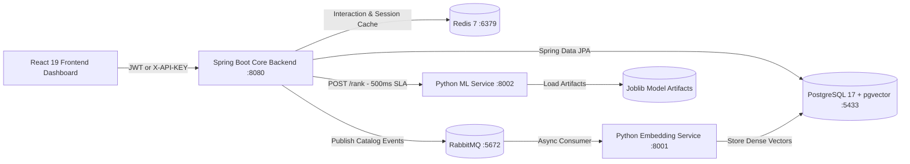

# 🍣 Susume — Enterprise Multi-Tenant AI Personalization & Recommendation Engine

[](https://www.oracle.com/java/)
[](https://spring.io/projects/spring-boot)
[](https://www.python.org/)
[](https://fastapi.tiangolo.com/)
[](https://www.sqlalchemy.org/)
[](https://scikit-learn.org/)
[](https://pytorch.org/)
[](https://www.postgresql.org/)
[](https://redis.io/)
[](https://www.rabbitmq.com/)
[](https://react.dev/)
[](https://tailwindcss.com/)
[](https://www.docker.com/)

**Susume** (*勧め — Japanese for "Recommendation"*) is an enterprise-grade, multi-tenant **Personalization-as-a-Service (PaaS)** platform. Built for modern high-scale e-commerce marketplaces, digital media platforms, and SaaS products, Susume powers real-time, context-aware user recommendations using a state-of-the-art **Two-Stage Machine Learning Pipeline**.

By decoupling **heuristic & dense vector candidate generation** (Java/Spring Boot Core) from **machine learning re-ranking** (Python/FastAPI ML Microservice), Susume achieves sub-200ms end-to-end latency, strict 99.99% availability SLAs with automated circuit-breaker fallback, and complete multi-tenant data isolation.

---

## 💡 Executive Summary & Architecture Highlights

In high-throughput consumer applications, static rule-based recommendations lead to low conversion and cold-start failures. Conversely, running deep learning model inference over an entire catalog for every request is computationally prohibitive and creates single-point-of-failure risks.

**Susume addresses this challenge with a resilient two-stage recommendation workflow:**

- **🎯 Conversion Probability Re-Ranking**: Predicts user interaction likelihood ($P(\text{click} \mid \text{user}, \text{item}, \text{context})$) across a **32-signal canonical feature vector** combining user activity, item popularity decay, surface contexts, and strategy candidate scores.
- **🏢 Native Multi-Tenancy**: Enforces strict tenant isolation across PostgreSQL relational queries, `pgvector` dense index namespaces, Redis session caches, and API authorization tokens (`X-API-KEY` / JWT).
- **🛡️ 99.99% Availability & SLA Fallback**: Employs a strict 500ms REST execution SLA on downstream ML re-ranking. If the ML service times out or degrades, Spring Boot seamlessly falls back to weighted strategy heuristics without dropping user requests.
- **🧠 Async Semantic Vector Indexing**: Computes 384-dimensional dense embeddings (`all-MiniLM-L6-v2`) via an asynchronous RabbitMQ queue whenever catalog items are ingested, persisting vectors into PostgreSQL 17 `pgvector` HNSW/IVFFlat indexes.
- **❄️ Instant Cold-Start Resolution**: Combines popularity decay, item tag taxonomy matching, and random exploration strategies to serve instant recommendations for new users with zero prior history.
- **📊 Offline ML Evaluation & Closed-Loop Telemetry**: Captures impression logs and user clickstream events to drive offline retraining pipelines measured via `NDCG@10`, `Recall@10`, and `Precision@10`.

---

## 🏗️ High-Level Product Architecture

```text
               ┌─────────────────────────────────────────────────────────┐
               │          React 19 Admin & Experience Console            │
               └────────────────────────────┬────────────────────────────┘
                                            │ HTTP (JWT / X-API-KEY)
                                            ▼
┌─────────────────────────────────────────────────────────────────────────────────────────────┐
│                            Spring Boot Multi-Tenant Core Backend                            │
│  - Multi-Tenant Auth Guard          - Candidate Pool Generation (10 Strategies)             │
│  - Interaction Stream Ingest        - SLA Enforcement & Heuristic Fallback Engine           │
└───────┬───────────────────────────────────┬──────────────────────────────────┬──────────────┘
        │                                   │                                  │
        ▼                                   ▼                                  ▼
┌─────────────────┐               ┌──────────────────┐               ┌──────────────────┐
│   Strategy 1    │               │    Strategy 2    │     ...       │   Strategy 10    │
│ Collaborative   │               │   Content-Based  │               │   pgvector Dense │
└───────┬─────────┘               └─────────┬────────┘               └─────────┬────────┘
        │                                   │                                  │
        └───────────────────────────────────┼──────────────────────────────────┘
                                            │
                                            ▼
                               Aggregated Candidate Pool (~100 items)
                               + Strategy Scores & Interaction Signals
                                            │
                                            ▼
                        ┌────────────────────────────────────────┐
                        │    Python ML Recommendation Service    │
                        │               (FastAPI)                │
                        │  - 32-Signal Canonical Feature Engineer│
                        │  - Scikit-Learn / XGBoost Ranker       │
                        │  - Sub-50ms Inference Scoring          │
                        └────────────────────┬───────────────────┘
                                             │
                                   Ranked Items + Probability Scores
                                             │
                                             ▼
                        ┌────────────────────────────────────────┐
                        │           Spring Boot Facade           │
                        │  - Top-K Candidate Selection           │
                        │  - Telemetry Impression Logging        │
                        └────────────────────┬───────────────────┘
                                             │
                                             ▼
                                   Personalized Response
```

---

## 🔬 Deep-Dive Technical Implementation

### 1. Stage 1: Candidate Generation Engine (`backend`)
The Spring Boot orchestrator executes 10 candidate generation strategies via [CandidateAggregator.java](file:///d:/Susume/backend/src/main/java/com/susume/recommendation/service/CandidateAggregator.java) to construct a high-recall candidate pool (~100 items):

| Strategy | Source Code Reference | Target Scenario & Algorithmic Design |
| :--- | :--- | :--- |
| **`CollaborativeFilteringStrategy`** | [CollaborativeFilteringStrategy.java](file:///d:/Susume/backend/src/main/java/com/susume/recommendation/strategy/CollaborativeFilteringStrategy.java) | Calculates Jaccard similarity matrix across user interaction histories. |
| **`ContentBasedStrategy`** | [ContentBasedStrategy.java](file:///d:/Susume/backend/src/main/java/com/susume/recommendation/strategy/ContentBasedStrategy.java) | Matches catalog taxonomy tags and metadata categories against user preferences. |
| **`FrequentlyBoughtTogether`** | [FrequentlyBoughtTogetherStrategy.java](file:///d:/Susume/backend/src/main/java/com/susume/recommendation/strategy/FrequentlyBoughtTogetherStrategy.java) | Computes co-occurrence matrices for items co-interacted in single user sessions. |
| **`HybridStrategy`** | [HybridStrategy.java](file:///d:/Susume/backend/src/main/java/com/susume/recommendation/strategy/HybridStrategy.java) | Computes a weighted ensemble of candidate strategies with strategy-level weights. |
| **`PersonalizedStrategy`** | [PersonalizedStrategy.java](file:///d:/Susume/backend/src/main/java/com/susume/recommendation/strategy/PersonalizedStrategy.java) | Matches active user interaction vectors against item profiles. |
| **`PopularityStrategy`** | [PopularityStrategy.java](file:///d:/Susume/backend/src/main/java/com/susume/recommendation/strategy/PopularityStrategy.java) | Ranks catalog items by cumulative engagement volume for guest users. |
| **`RandomDiscoveryStrategy`** | [RandomDiscoveryStrategy.java](file:///d:/Susume/backend/src/main/java/com/susume/recommendation/strategy/RandomDiscoveryStrategy.java) | Injects randomized high-quality candidates to combat filter bubbles. |
| **`RuleBasedStrategy`** | [RuleBasedStrategy.java](file:///d:/Susume/backend/src/main/java/com/susume/recommendation/strategy/RuleBasedStrategy.java) | Filters and ranks items based on tenant-configured business rules. |
| **`SimilarItemsStrategy`** | [SimilarItemsStrategy.java](file:///d:/Susume/backend/src/main/java/com/susume/recommendation/strategy/SimilarItemsStrategy.java) | Performs HNSW cosine vector search (`pgvector`) on catalog embeddings. |
| **`TrendingStrategy`** | [TrendingStrategy.java](file:///d:/Susume/backend/src/main/java/com/susume/recommendation/strategy/TrendingStrategy.java) | Applies exponential time-decay scoring to recent high-frequency interactions. |

### 2. Stage 2: Feature Engineering & ML Re-ranking (`recommendation-service`)
The Python FastAPI microservice accepts candidate items and builds a **32-Signal Feature Vector** for every user-item candidate pair in [features.py](file:///d:/Susume/recommendation-service/app/ranking/features.py):

```text
32 Canonical Signals Breakdown:
├── Strategy Scores (10): [contentBased, collaborativeFiltering, frequentlyBoughtTogether, hybrid, 
│                          personalized, popularity, randomDiscovery, ruleBased, similarItems, trending]
├── User Features    (8): [totalViews, totalClicks, totalLikes, totalPurchases, totalInteractions, 
│                          interactionsLast24Hours, interactionsLast7Days, interactionsLast30Days]
├── Item Features    (6): [itemPopularity, recentViews, recentClicks, recentLikes, recentPurchases, itemAge]
├── User-Item Pair   (5): [previousViews, previousClicks, previousLikes, previousPurchases, timeSinceLastInteraction]
└── Context Features (3): [surfaceCode, hourOfDay, dayOfWeek]
```

The inference engine in [ranker.py](file:///d:/Susume/recommendation-service/app/ranking/ranker.py) evaluates feature vectors using pre-trained model weights (`susume_ranker_v1.joblib`) to produce probability scores used for final ordering.

### 3. Asynchronous Vector Embedding Microservice (`embedding-service`)
- **Model**: `sentence-transformers/all-MiniLM-L6-v2` generating 384-dimensional dense vectors.
- **Event-Driven Broker**: Item creations/updates publish catalog events over **RabbitMQ**.
- **Vector Persistence**: [main.py](file:///d:/Susume/embedding-service/main.py) computes dense vector embeddings asynchronously and updates PostgreSQL 17 using native `pgvector` indexes (`HNSW`/`IVFFlat`).

### 4. Resilient Fallback Engine & SLA Enforcement
Production reliability is enforced in [RecommendationRankingClient.java](file:///d:/Susume/backend/src/main/java/com/susume/recommendation/client/RecommendationRankingClient.java):
- **500ms SLA Timeout**: Non-blocking REST client timeout enforced per request.
- **Circuit Breaker Fallback**: If the Python service fails or times out, Spring Boot falls back to candidate ordering by heuristic scores without dropping response payloads.
- **Impression Logging**: All returned items log impression telemetry to database tables via [RecommendationFacade.java](file:///d:/Susume/backend/src/main/java/com/susume/recommendation/service/RecommendationFacade.java).

---

## ⚡ Multi-Service Topology & Network Map



| Service Component | Technology Stack | Container Port | Core Functionality |
| :--- | :--- | :--- | :--- |
| **Spring Boot Core** | Java 17, Spring Boot 3.2 | `:8080` | Gateway, Auth, Multi-Tenancy, Strategy Pool Aggregator, SLA Facade |
| **Python ML Ranker** | Python 3.11, FastAPI, scikit-learn | `:8002` | 32-signal feature engineering, ML model scoring, re-ranking REST API |
| **Embedding Engine** | Python 3.11, FastAPI, PyTorch | `:8001` | Async NLP vector generation (`all-MiniLM-L6-v2`) via RabbitMQ |
| **PostgreSQL Database** | PostgreSQL 17 + `pgvector` | `:5433` | Relational tables, impression logging, vector similarity search |
| **Redis Cache** | Redis 7 | `:6379` | User interaction caching & active tenant session store |
| **RabbitMQ Queue** | RabbitMQ 3 Management | `:5672` / `:15672` | Asynchronous event broker for catalog ingestion events |
| **React Dashboard** | React 19, TypeScript, Tailwind v4 | `:80` | Editorial Ronin UI, strategy tuning, API keys, usage stats |

---

## 📊 Offline ML Training & Evaluation Pipeline

Susume includes an offline training engine built to prevent data leakage and ensure ranking quality:

1. **Negative Sampling** ([dataset.py](file:///d:/Susume/recommendation-service/training/dataset.py)): Pairs true positive user interactions with non-interacted items at a 1:3 ratio.
2. **Temporal Split**: Chronologically splits historical interaction data (80% training, 20% validation) to reflect true production conditions.
3. **Evaluation Metrics** ([evaluate.py](file:///d:/Susume/recommendation-service/training/evaluate.py)):
   - `NDCG@10` (Normalized Discounted Cumulative Gain): Measures rank position sensitivity and quality.
   - `Recall@10` & `Precision@10`: Measures candidate coverage and top-K relevance.
4. **Model Training & Serialization** ([train.py](file:///d:/Susume/recommendation-service/training/train.py)): Serializes low-latency binary `.joblib` model artifacts for production scoring.

---

## 🛠️ Tech Stack & Ecosystem

- **Backend & Core Engine**: Java 17, Spring Boot 3.2, Spring Security, Spring Data JPA, Flyway, RestTemplate, Jackson
- **ML & Data Science**: Python 3.11, FastAPI, SQLAlchemy 2.0 (`asyncpg`), scikit-learn, PyTorch, HuggingFace `sentence-transformers`, NumPy, Pandas, Joblib, Pydantic, Pytest
- **Database & Storage**: PostgreSQL 17 with `pgvector` extension (HNSW / IVFFlat indexing)
- **Messaging & Caching**: RabbitMQ 3, Redis 7
- **Frontend Dashboard**: React 19, TypeScript, Vite, Tailwind CSS v4, Lucide React, TanStack Query
- **DevOps & Infrastructure**: Docker, Docker Compose, Flyway DB Migrations

---

## 📁 Repository Structure & Key Code References

```text
.
├── backend/                                  # Java 17 Spring Boot Multi-Tenant Core Backend
│   ├── src/main/java/com/susume/recommendation/
│   │   ├── client/
│   │   │   └── RecommendationRankingClient.java   # Resilient HTTP Client with 500ms SLA Fallback
│   │   ├── controller/                       # Recommendation, Item, Interaction, & Auth Controllers
│   │   ├── dto/                              # DTO payloads & ranking schemas
│   │   ├── entity/                           # JPA Entities (Tenant, Item, Interaction, Impression)
│   │   ├── service/
│   │   │   ├── CandidateAggregator.java       # Candidate pool generator executing 10 strategies
│   │   │   └── RecommendationFacade.java      # Top-K selection & impression logging facade
│   │   └── strategy/                         # 10 Strategy implementations (Collaborative, Vector, etc.)
│   └── src/main/resources/db/migration/     # Flyway SQL schema migrations (V1 - V8)
│
├── recommendation-service/                   # Python 3.11 FastAPI ML Candidate Re-Ranker
│   ├── app/
│   │   ├── api/                              # FastAPI endpoints (/rank, /health)
│   │   ├── db/
│   │   │   ├── session.py                     # Async SQLAlchemy 2.0 engine session manager
│   │   │   └── models.py                      # ORM models (Item, Interaction, Impression, Tenant)
│   │   ├── ranking/
│   │   │   ├── features.py                   # 32-Signal canonical feature vector engineer
│   │   │   └── ranker.py                     # ML scoring ranker engine
│   │   └── schemas/                          # Pydantic validation schemas
│   ├── training/
│   │   ├── dataset.py                     # Negative sampling & historical data loader
│   │   ├── train.py                       # Training pipeline execution script
│   │   └── evaluate.py                    # Evaluation metrics script (NDCG@10, Recall@10)
│   └── tests/                                # Pytest suite for feature construction & APIs
│
├── embedding-service/                        # Python 3.11 Async Dense Vector Generator
│   ├── db.py                                 # SQLAlchemy pgvector catalog & vector updates
│   └── main.py                               # HuggingFace dense vector generator (384-dim)
│
├── frontend/                                 # React 19 + Tailwind v4 Admin Dashboard
│   ├── src/
│   │   ├── features/
│   │   │   ├── authentication/               # Tenant Login, Register, & Auth State
│   │   │   └── dashboard/                    # Overview, Strategy Management, API Keys, Docs
│   │   ├── components/                       # Editorial Ronin UI Design Components
│   │   └── services/                         # REST API Client Service Layer
│
├── docker-compose.yml                        # Docker multi-service container orchestration
├── .env.example                              # Master environment variables template
└── README.md
```

---

## 🚀 Quick Start with Docker Compose

### Prerequisites
- [Docker Desktop](https://www.docker.com/products/docker-desktop/) (Docker Engine + Compose)
- Java 17+ (for local backend development)
- Python 3.11+ (for local ML training development)

### 1. Environment Setup
Copy [.env.example](file:///d:/Susume/.env.example) to `.env` in the root directory:

```bash
cp .env.example .env
```

Ensure default environment configurations:
```env
POSTGRES_DB=susume
POSTGRES_USER=postgres
POSTGRES_PASSWORD=postgres
POSTGRES_VOLUME_SOURCE=./docker-data/postgres
EMBEDDING_SOURCE_VOLUME_SOURCE=./docker-data/embedding-service

RABBITMQ_USERNAME=guest
RABBITMQ_PASSWORD=guest

JWT_SECRET=cG9hc2Qyazg4OWFzZGZoamtsc2E5ODc2N2FzZGZoamtsc2E5
RECOMMENDATION_SERVICE_URL=http://recommendation-service:8002
```

### 2. Launch Container Topology
Build and start all microservices in detached mode:

```bash
docker compose up -d --build
```

### 3. Service Verification & Health Status

| Service Name | Local Endpoint URL | Health Check / Verification Route |
| :--- | :--- | :--- |
| **Spring Boot Backend** | `http://localhost:8080` | `GET /actuator/health` |
| **Python ML Ranker** | `http://localhost:8002` | `GET /health` -> `{"status":"healthy"}` |
| **Embedding Engine** | `http://localhost:8001` | `GET /health` -> `{"status":"healthy"}` |
| **React Dashboard** | `http://localhost` | Browser Dashboard Interface |
| **RabbitMQ Console** | `http://localhost:15672` | Login: `guest` / `guest` |
| **PostgreSQL 17** | `localhost:5433` | PostgreSQL (`susume` database) |

---

## 🧪 Local Microservice Testing & Model Training

### 1. Python ML Microservice Unit Tests & Training
To run unit tests and execute model retraining offline:

```bash
cd recommendation-service

# Install dependencies
pip install -r requirements.txt

# Run Pytest suite
python -m pytest

# Execute offline training pipeline & output evaluation metrics
python -m training.train
```

### 2. Spring Boot Core Backend Tests
To run Java unit and integration tests:

```bash
cd backend
./mvnw test
```

---

## 🎯 Key REST API Reference

### Recommendations & Ranking
- `GET /api/v1/recommendations` — Returns personalized top-K recommendations for user (Candidate Generation + ML Re-Ranking)
- `GET /api/v1/recommendations/trending` — Returns global trending items fallback
- `POST /api/v1/recommendations/rank` *(Internal Python ML API)* — Candidate re-ranking and 32-signal feature scoring

### Catalog Items & Clickstream Telemetry
- `POST /api/v1/items` — Register/update catalog items & publish RabbitMQ embedding event
- `POST /api/v1/interactions` — Track user clickstream events (`VIEW`, `CLICK`, `LIKE`, `PURCHASE`)
- `GET /api/v1/interactions/history` — Retrieve user interaction history timeline

---

## 🎨 Admin Dashboard & User Interface

The React 19 frontend is crafted following **The Editorial Ronin** design language (manga-inspired typography, high contrast, offset layouts, and dynamic micro-animations):

- **Dashboard Home**: Real-time throughput metrics, latency monitoring, and active candidate strategies.
- **Strategy Management**: Fine-tune weights across candidate strategies in real-time.
- **API Key Manager**: Generate and rotate multi-tenant `X-API-KEY` credentials.
- **Interactive API Documentation**: Embedded API explorer with copy-paste code snippets for integrations.
- **Stats & Telemetry Usage**: Live charts displaying impression metrics and click-through rates.

---

## 🌟 Engineering Achievements & Best Practices

- **Decoupled Architecture**: Seamlessly decouples high-speed Spring Boot candidate generation from Python machine learning re-ranking.
- **Production Resilience**: Built-in 500ms REST SLA timeout with automatic fallback guarantees system uptime during ML microservice outages.
- **Rigorous ML Methodology**: Implements temporal train/test splitting, negative sampling (1:3 ratio), and `NDCG@10` tracking to prevent offline data leakage.
- **Full-Stack Execution**: Integrates Java 17, Python 3.11, PyTorch sentence-transformers, `pgvector`, RabbitMQ, Redis, and React 19 into a single production dockerized stack.

---

## 📜 License

This project is licensed under the [MIT License](LICENSE).
