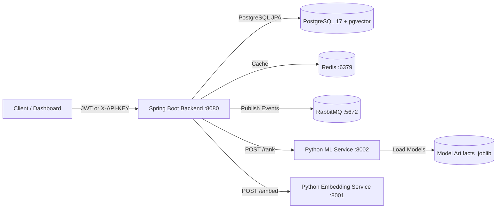

# Susume - Multi-Tenant Recommendation Engine with ML Re-Ranking

[](https://www.oracle.com/java/)
[](https://spring.io/projects/spring-boot)
[](https://www.python.org/)
[](https://fastapi.tiangolo.com/)
[](https://scikit-learn.org/)
[](https://www.postgresql.org/)
[](https://react.dev/)
[](https://www.docker.com/)

**Susume** is a enterprise-grade, multi-tenant recommendation platform designed for scalable, real-time personalization. It features a modern **two-stage recommendation architecture** that combines heuristic and vector candidate generation in Spring Boot with a Python-based ML re-ranking service.

---

## 🌟 How Susume Works (High-Level Overview)

Susume separates **candidate generation** (finding *what might be relevant*) from **ML re-ranking** (deciding *which candidates to recommend first*).

```text
               ┌─────────────────────────────────────────┐
               │              React Client               │
               └────────────────────┬────────────────────┘
                                    │ HTTP Request (X-API-KEY / JWT)
                                    ▼
┌────────────────────────────────────────────────────────────────────────┐
│                        Spring Boot Core Backend                        │
│  - Tenant Authorization      - Interaction Ingestion                   │
│  - Candidate Aggregation     - Fallback Handling                       │
└────────┬──────────────────────────┬──────────────────────────┬─────────┘
         │                          │                          │
         ▼                          ▼                          ▼
 ┌──────────────┐           ┌──────────────┐           ┌──────────────┐
 │  Strategy 1  │           │  Strategy 2  │   ...     │ Strategy 10  │
 │ Popularity   │           │ Collaborative│           │ Trending     │
 └───────┬──────┘           └───────┬──────┘           └───────┬──────┘
         │                          │                          │
         └──────────────────────────┼──────────────────────────┘
                                    │
                         Aggregated Candidate Pool (e.g. 100 items)
                         + Preserved Strategy Scores & User Signals
                                    │
                                    ▼
               ┌─────────────────────────────────────────┐
               │    Python ML Recommendation Service     │
               │               (FastAPI)                 │
               │  - Feature Engineering (32 signals)    │
               │  - Logistic Regression / XGBoost Ranker │
               │  - Cold-Start Handling                  │
               └────────────────────┬────────────────────┘
                                    │
                         Ranked Item IDs + ML Scores
                                    │
                                    ▼
               ┌─────────────────────────────────────────┐
               │            Spring Boot Facade           │
               │  - Impression Persistence               │
               │  - Top-K Selection & Response Formatting│
               └────────────────────┬────────────────────┘
                                    │
                                    ▼
                               Client App
```

---

## 🏗️ Architecture & Core Components

### 1. Spring Boot Backend (`backend`)
- **Multi-Tenant Isolation**: Tenant context enforcement across database queries, Redis caching, and API keys.
- **Candidate Generators**: 10 Spring Boot strategies that generate candidate pools:
  - `CollaborativeFilteringStrategy` (Jaccard similarity over user interaction overlaps)
  - `ContentBasedStrategy` (Text/category similarity matching)
  - `FrequentlyBoughtTogetherStrategy` (Co-occurrence interaction analysis)
  - `HybridStrategy` (Weighted combination of heuristic strategies)
  - `PersonalizedStrategy` (User interaction vector matching)
  - `PopularityStrategy` (Total interaction volume weighting)
  - `RandomDiscoveryStrategy` (Serendipitous candidate discovery)
  - `RuleBasedStrategy` (Deterministic category and attribute rules)
  - `SimilarItemsStrategy` (Item-to-item vector similarity)
  - `TrendingStrategy` (Time-decayed recent interaction frequency)
- **Candidate Aggregation ([CandidateAggregator.java](file:///d:/Susume/backend/src/main/java/com/susume/recommendation/service/CandidateAggregator.java))**: Merges candidate items across enabled strategies, preserves strategy scores, and constructs user/item feature payloads.
- **Resilience & Fallback ([RecommendationRankingClient.java](file:///d:/Susume/backend/src/main/java/com/susume/recommendation/client/RecommendationRankingClient.java))**: Invokes the Python service with a 500ms timeout. If the Python service is offline or errors out, Spring Boot seamlessly falls back to Spring strategy ordering.
- **Impression Logging**: Stores recommendation impressions (`requestId`, `tenantId`, `userId`, `itemId`, `position`, `timestamp`, `modelVersion`, `strategyScores`) in PostgreSQL.

### 2. Python ML Recommendation Microservice (`recommendation-service`)
- **FastAPI Endpoint (`POST /api/v1/recommendations/rank`)**: High-performance HTTP service optimized for low p95 latency (<200ms).
- **Canonical Feature Engineering ([app/ranking/features.py](file:///d:/Susume/recommendation-service/app/ranking/features.py))**: Extracts 32 canonical features per candidate:
  - **Strategy Scores (10)**: `contentBased`, `collaborativeFiltering`, `frequentlyBoughtTogether`, `hybrid`, `personalized`, `popularity`, `randomDiscovery`, `ruleBased`, `similarItems`, `trending`.
  - **User Features (8)**: `totalViews`, `totalClicks`, `totalLikes`, `totalPurchases`, `totalInteractions`, `interactionsLast24Hours`, `interactionsLast7Days`, `interactionsLast30Days`.
  - **Item Features (6)**: `itemPopularity`, `recentViews`, `recentClicks`, `recentLikes`, `recentPurchases`, `itemAge`.
  - **User-Item Features (5)**: `previousViews`, `previousClicks`, `previousLikes`, `previousPurchases`, `timeSinceLastInteraction`.
  - **Context Features (3)**: `surfaceCode`, `hour`, `dayOfWeek`.
- **Training Pipeline ([training/train.py](file:///d:/Susume/recommendation-service/training/train.py))**:
  - Performs **Negative Sampling** (1 positive : 3 negatives ratio).
  - Uses a **Temporal Split** (80% historical data for training, 20% newer data for testing).
  - Trains a Logistic Regression model to predict binary interaction probability.
  - Computes offline evaluation metrics (`NDCG@10`, `Recall@10`, `Precision@10`) using [training/evaluate.py](file:///d:/Susume/recommendation-service/training/evaluate.py).
  - Exports model artifacts (`.joblib`) and metadata (`.json`).

### 3. FastAPI Embedding Microservice (`embedding-service`)
- Converts raw item text/metadata into dense 384-dimensional vector embeddings using `sentence-transformers` (`all-MiniLM-L6-v2`).
- Integrated asynchronously via **RabbitMQ** event queue for non-blocking catalog updates.

---

## ⚡ Multi-Service Topology



---

## 🛠️ Tech Stack

- **Backend**: Java 17, Spring Boot 3.2, Spring Security, Spring Data JPA, Flyway, RestTemplate
- **ML & Data Science**: Python 3.11, FastAPI, scikit-learn, pandas, numpy, joblib, pydantic, pytest
- **NLP / Embeddings**: PyTorch, sentence-transformers (`all-MiniLM-L6-v2`)
- **Database & Storage**: PostgreSQL 17 + pgvector extension
- **Messaging & Cache**: RabbitMQ, Redis 7
- **Frontend**: React 19, TypeScript, Vite, Tailwind CSS
- **DevOps & Containers**: Docker, Docker Compose

---

## 📁 Repository Structure

```text
.
├── backend/                  # Spring Boot backend API & candidate strategies
│   ├── src/main/java/com/susume/recommendation/
│   │   ├── client/           # Python ML service REST client with fallback
│   │   ├── controller/       # Recommendation & Item REST controllers
│   │   ├── dto/              # Candidate & Rank DTO models
│   │   ├── entity/           # Item, Interaction, & Impression JPA entities
│   │   ├── service/          # CandidateAggregator & RecommendationFacade
│   │   └── strategy/         # 10 Spring Boot recommendation strategies
│   └── src/main/resources/db/migration/ # Flyway SQL migrations (V1-V8)
│
├── recommendation-service/   # Python FastAPI ML candidate re-ranking service
│   ├── app/                  # FastAPI endpoints, Pydantic schemas, feature builder, model loader
│   ├── training/             # Dataset loader, negative sampling, temporal split, train & evaluate scripts
│   ├── models/               # Trained joblib ML models and metadata JSON
│   ├── tests/                # Pytest suite (API, features, metrics tests)
│   ├── Dockerfile            # Container configuration
│   └── requirements.txt      # Python dependencies
│
├── embedding-service/        # FastAPI sentence-transformers embedding microservice
├── frontend/                 # React + TypeScript dashboard application
├── docker-compose.yml        # Orchestration for all 6 containers
└── README.md
```

---

## 🚀 Quick Start with Docker Compose

### Prerequisites
- Docker Desktop (or Docker Engine + Docker Compose)
- Java 17+ (for local backend development)
- Python 3.11+ (for local ML training/testing)

### 1. Environment Configuration
Create a `.env` file in the project root:

```env
POSTGRES_DB=susume
POSTGRES_USER=postgres
POSTGRES_PASSWORD=postgres
POSTGRES_VOLUME_SOURCE=./docker-data/postgres

EMBEDDING_SOURCE_VOLUME_SOURCE=./docker-data/huggingface

RABBITMQ_USERNAME=guest
RABBITMQ_PASSWORD=guest

JWT_SECRET=your-secure-jwt-secret-key
RECOMMENDATION_ML_ENABLED=true
RECOMMENDATION_SERVICE_URL=http://recommendation-service:8002
```

### 2. Launch All Services
Run Docker Compose from the root directory:

```bash
docker compose up -d --build
```

### 3. Verify Running Services

| Service | Endpoint / URL | Purpose |
| :--- | :--- | :--- |
| **Spring Boot Backend** | `http://localhost:8080` | Core API, candidate generation & facade |
| **Python ML Re-Ranker** | `http://localhost:8002/health` | ML candidate re-ranking endpoint |
| **Python Embedding Service**| `http://localhost:8001/health` | Dense vector embedding generator |
| **React Dashboard** | `http://localhost` | Tenant admin frontend |
| **RabbitMQ Dashboard** | `http://localhost:15672` | Async event queue management |
| **PostgreSQL 17** | `localhost:5433` | Primary database with pgvector |

---

## 🧪 Training & Testing

### Run Python Tests & Offline ML Model Training
To run pytest and execute model training offline:

```bash
cd recommendation-service

# Install dependencies
pip install -r requirements.txt

# Run pytest unit tests
python -m pytest

# Train ML model and print offline metrics (NDCG@10, Recall@10)
python -m training.train
```

### Run Spring Boot Tests
```bash
cd backend
./mvnw test
```

---

## 🎯 High-Level API Endpoints

### Recommendations & Ranking
- `GET /api/v1/recommendations` - Get personalized recommendations (candidate generation + ML re-ranking)
- `GET /api/v1/recommendations/trending` - Get trending items fallback
- `POST /api/v1/recommendations/rank` *(Python Service)* - Candidate scoring and re-ranking endpoint

### Catalog & Interactions Ingestion
- `POST /api/v1/items` - Create/update tenant catalog items
- `POST /api/v1/interactions` - Record user interaction (VIEW, CLICK, LIKE, PURCHASE)
- `GET /api/v1/interactions/history` - Fetch historical interactions

---

## Recruiters & Engineering Highlights

- **Production-Grade Architecture**: Designed a decoupled, multi-stage recommendation engine using enterprise design patterns.
- **Resilience & Zero-Downtime Design**: Implemented graceful HTTP client fallbacks ensuring recommendation availability even if ML services experience downtime.
- **Offline ML Evaluation**: Built offline evaluation pipelines reporting `NDCG@10`, `Recall@10`, and `Precision@10` metrics on temporal train/test splits.
- **Full-Stack Implementation**: Delivered backend Java APIs, Python ML microservices, database migrations, Docker orchestration, and a React frontend.

---

## 📜 License

This project is licensed under the MIT License.
